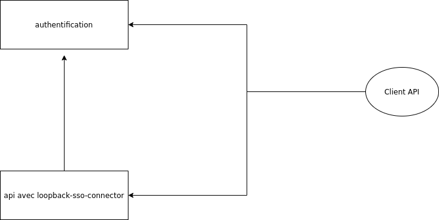

# Micro-service d'authentification

Ce projet est un micro-service pour la gestion de l'authentification et de l'authorisation.

Il est utilisé par les projets suivants :

* Mercadex-mx
* Xmation

La librairie [@berlingoqc/loopback-sso-connector]("https://github.com/Alborea/alb-loopback-auth") peut être utilisée pour connecter un API au système.

## Fonctionnalités fournises



1. Connecte avec service d'authentification
2. Reçoit un JWT
3. Fait une requête à l'API
4. L'API valide le token et les rôles de l'usager selon la configuration du end-point en communiquant avec le service d'authorisation

### Usager

* Création de compte public ou privé (par invitation seulement)
* Authentification multi-factor (SMS et email)
* Compte avec date d'expiration pouvant être bloqué et supprimé
* Champs additionnels pour données spécifiques aux applications
* Rôles multiples
* Organisations multiples

### Organisation

* Création privée par l'admin avec un manager qui gère l'organisation
* Les organisations ont un type qui permet dans une application d'offrir fonctionnalité différente selon le type.
* Permet de regrouper des usagers ensemble
* Permet d'inviter des usagers à rejoindre, s'il ont un compte sur la plateform ou non.
* Possibilité d'avoir des rôles dans l'organisation contrôlée par le manager.
* Permet certaine fonctionnalité admin sur les usagers de l'organisation

### Courriel

* Permet de crée des templates de courriel avec des variables qu'on peut envoyé au usager.
* Version HTML et Texte
* API pour le render seulement pour utiliser dans les push notifications et les sms.
* Les applications doivent configurer les courriels de base dans la DB:
  + INVITE_USER
  + OTP
  + CONFIRM_ACCOUNT

## Démarrer et Builder

Pour le démarrer vous devez configurer les variables d'enrionnement suivantes.

``` bash
npm run start
```

### Avec docker

Afin d'avoir accès aux images d'Alborea, vous devez d'abord vous connecter au
registry GitHub:

``` bash
$ docker login docker.pkg.github.com
Username: <username>
Password: <password>
```

Ensuite, vous pouvez construire les images:

``` bash
# Build l'image docker sso
npm run docker:build

# Publie l'image sur le docker registery de GitHub doit être login dedans
npm run docker:publish
```

Et démarrer un SSO avec une BD:

``` bash
# Docker compose host, démarre sso avec une db et donnée de base
npm run compose:host up
# Docker compose test, démarre sso, db et execute test unitaire et test e2e
npm run compose:test up
```

### Variables d'environment

``` bash
# Config JSON pour le micro-service
export SSO_SETTINGS="{\"publicCreation\":true,\"multiFactor\":false,\"accountValidation\":true, \"defaultRoles\": []}"

# URL de connection avec la db postgres
export DB_URL=postgres://...

# Variable de configuration pour l'envoie d'email
export EMAIL_FROM='"Name" <email@email.com>'
export EMAIL_USER=authuser
export EMAIL_PASSWORD=password
export EMAIL_REDIRECT=url du site à redirigé

# Variable de connection pour l'envoir de sms (si multiFactor a true)
export SMS_SID=
export SMS_TOKEN=
export SMS_NUMBER=

# Variable de configuration pour les OTP
export OTP_SECRET=

# Variable de configuration pour le JWT
export JWT_SECRET=
export JWT_TTL=
```

### Tests

Le dossier `./postman` contient la collection et les environments pour
les tests d'intégrations.

``` bash
# TEST postman
# env local
npm run test:pm:local
# env dev
npm run test:pm:dev

# Unitaire
npm run test
```

### CLI

* alb-sso-create-admin : Permet de crée un compte admin dans la plateform

``` bash
DB_URL=... node ./dist/create-admin.js EMAIL PASSWORD
```
